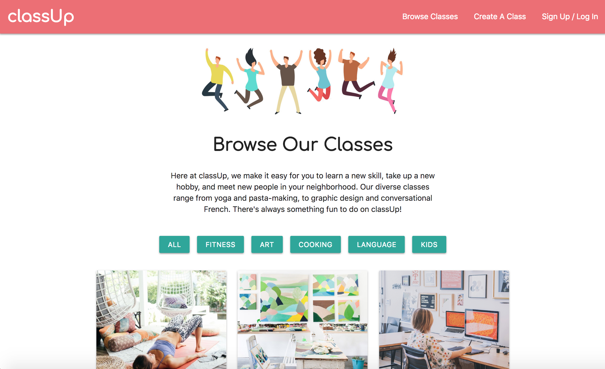

# classUp

An online resource to find, create, and share workshops and classes.

### About This Project

We've all got a few special talents that set us apart from everyone else. At classUp, you can share your expertise with others by creating your own course and making some extra cash on the side.

Help your neighbors discover their new passion or teach them a savvy skill. Our diverse classes range from outdoor yoga and pasta-making, to graphic design and conversational French. Users are able to:
* Browse all classes
* Filter classes by category
* Create their own class
* Sign up for classes
* Create a user account

### Technologies Used

HTML5, CSS3, Materialize CSS, Javascript, jQuery, Node JS, Express, Handlebars, MySQL, Stripe API, Passport, Moment JS, Google Fonts

### View The Project

Visit [this page]() to browse our classes or create your own!

